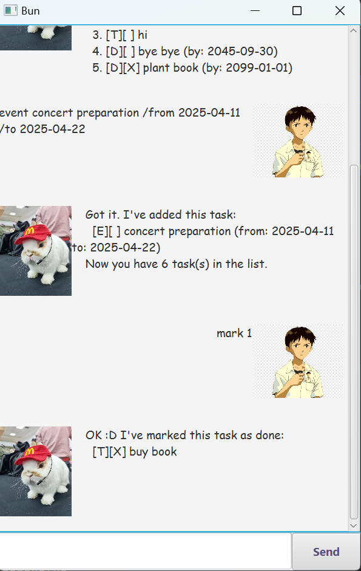

# Bun User Guide

Welcome to Bun! Your personal task manager.



## Getting Started

1. Download the `.jar` file from the latest release.
2. Run `java -jar bun.jar`.

## Features

### Add Tasks
Add different types of tasks such as todos, deadlines, doafters, or events.

### View Tasks
Displays all currently stored tasks.

### Mark/Unmark Tasks
Set a task as completed or revert it back to pending status.

### Remove Tasks
Delete a task when it's no longer needed.

### Search Tasks
Find specific tasks by searching for keywords.

### Exit
Close the application.

## Usage

### Adding a To-Do Task: `todo`

Adds a simple to-do task to your list.

Format: `todo (DESCRIPTION)`

Examples:
* `todo Buy groceries`
* `todo Finish project`

Expected Outcome:

```
Got it. I've added this task:
  [T][ ] Buy groceries
Now you have 1 task in the list.
```

### Adding a Deadline: `deadline`

Adds a deadline to the task list.

Format: `deadline (DESCRIPTION) /by (DATE)`

```
* `DATE` should follow yyyy-MM-dd format.
```

Examples:
* `deadline Report submission /by 2024-07-21`

Expected Outcome:

```
Got it. I've added this task:
  [D][ ] Report submission (by: 2024-07-21)
Now you have 2 tasks in the list.
```

### Adding a Do-After Task: `doafter`

Adds a task that should be done after a certain date.

Format: `doafter (DESCRIPTION) /after (DATE)`

```
* `DATE` should follow yyyy-MM-dd format.
```

Examples:
* `doafter Start new project /after 2024-08-01`

Expected Outcome:

```
Got it. I've added this task:
  [S][ ] Start new project (after: 2024-08-01)
Now you have 3 tasks in the list.
```

### Adding an Event: `event`

Adds an event task to your list.

Format: `event (DESCRIPTION) /from (FROM) /to (TO)`

```
* Both `FROM` and `TO` should follow yyyy-MM-dd format.
```

Examples:
* `event Sprint 1 /from 2025-04-01 /to 2025-04-16`
* `event Workshop /from 2025-03-01 /to 2025-03-03`

Expected Outcome:

```
Got it. I've added this task:
  [E][ ] Sprint 1 (from: 2025-04-01 to: 2025-04-16)
Now you have 4 tasks in the list.
```

### Searching for Tasks: `find`

Search for tasks that match a given keyword.

Format: `find (KEYWORD)`

Examples:
* `find groceries`

Expected Outcome:

```
Here are the matching tasks in your list:
 [T][ ] Buy groceries
```

### Marking a Task as Done: `mark`

Marks a task as completed.

Format: `mark (INDEX)`

```
* `INDEX` must be a valid task number.
```

Examples:
* `mark 2`

Expected Outcome:

```
OK :D I've marked this task as done:
  [D][X] Report submission (by: 2024-07-21)
```

### Unmarking a Task: `unmark`

Marks a task as not completed.

Format: `unmark (INDEX)`

```
* `INDEX` must be a valid task number.
```

Examples:
* `unmark 2`

Expected Outcome:

```
OK :D I've marked this task as not done yet:
  [D][ ] Report submission (by: 2024-07-21)
```

### Deleting a Task: `remove`

Removes a task from the list.

Format: `remove (INDEX)`

Examples:
* `remove 2`

Expected Outcome:

```
Noted. I've removed this task:
  [D][ ] Report submission (by: 2024-07-21)
Now you have 3 tasks in the list.
```

### Listing All Tasks: `list`

Displays all current tasks.

Format: `list`

Expected Outcome:

```
Here are the tasks in your list:
1. [T][ ] Buy groceries
2. [S][ ] Start new project (after: 2024-08-01)
3. [E][ ] Sprint 1 (from: 2025-04-01 to: 2025-04-16)
```


### Exiting the Application: `bye`

Closes the application.

Format: `bye`

